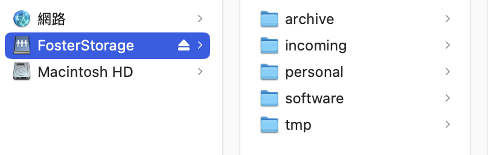

# FosterStorage User Manual

| Field | Details |
|---|---|
| Author | Ming Liu|
| Last updated | 14 May 2026 |
| Version | 1.0 |
| Scope | User guide for accessing and using FosterStorage |

---

# 1. About the Foster Storage
Our storage server was purchased under the ERC fungings. Many thanks to Kevin for providing such a great storage resource! This manual explains the current FosterStorage folder structure and how users can connect from their personal computer through StrasterTower.

The server contains:

- One solid state drive (SSD)
  - Approximately 500 GB NVMe SSD.
  - Used for the operating system, boot partitions, and server configuration.
  - The main system volume `/` is currently allocated 100 GB through LVM.
  - This SSD should not be used for user data.

- One large hard disk drive (HDD) storage array
  - Built from 12 × 20 TB HDDs.
  - Configured as a RAID6 array.
  - Mounted at `/drive`.
  - Linux reports the usable mounted capacity as approximately 181.9 TB/TiB.

The intended access route to FosterStorage is:

```text
Personal computer
  → SSH tunnel through StrasterTower
  → FosterStorage Samba share
```

## 2. Folder structure on FosterStorage

FosterStorage is organised as one user-facing network share called: `FosterStorage`

After connecting, users will see:

```text
FosterStorage
├── incoming
├── personal
├── archive
├── software
└── tmp
```

Here is a brief description for the intention of each foler:

| Folder | Purpose | Who can read? | Who can write? | Recommended use |
|---|---|---|---|---|
| `incoming` | Newly transferred data from instruments, downloads, or acquisition computers | All users | All users | Use for real data that has just arrived and has not yet been curated. Create clearly named folders, e.g. `2026-05-14_ming_bug_images`. |
| `personal` | User-specific working space | All users | Only the owner inside their own folder | Use for personal analysis, working files, and user-specific project folders. Top-level personal folders are created by administrators. |
| `archive` | Curated or finalised data | All users | Administrators only | Use for data that should be preserved and not casually modified. |
| `software` | Shared tools, installers, scripts, and reusable resources | All users | Administrators only | Use for shared software resources, not project data. |
| `tmp` | Temporary transfer or scratch space | All users | All users | Use only for disposable files. Important data should be moved elsewhere. |

## 3. Connecting from a personal computer (Unix-based)

Because FosterStorage is behind StrasterTower, users connect by creating an SSH tunnel from their personal computer.

### 3.1 The tunnel forwards
Replace `$USER` with your StrasterTower username.
```bash
ssh -N -f -o ExitOnForwardFailure=yes -L 1445:192.168.50.10:445 $USER@strastertower.path.ox.ac.uk
```

Optional: Check whether the tunnel is running. (Expected result: an ssh process listening on localhost:1445.)
```bash
lsof -iTCP:1445 -sTCP:LISTEN
```

After the tunnel is open, the user connects their file browser to:

```bash
smb://localhost:1445/FosterStorage
```

Use your SMB username and password when prompted.

### 3.2 Stop the tunnel
```bash
lsof -tiTCP:1445 -sTCP:LISTEN | xargs kill
```

If the tunnel does not close, use this fallback:
```bash
lsof -tiTCP:1445 -sTCP:LISTEN | xargs kill -9
```

Here is an example of how it looks like once the connection is successful.

<p align="center">
  
</p>
