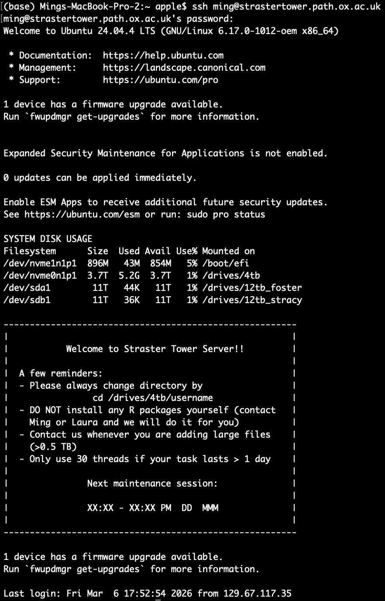
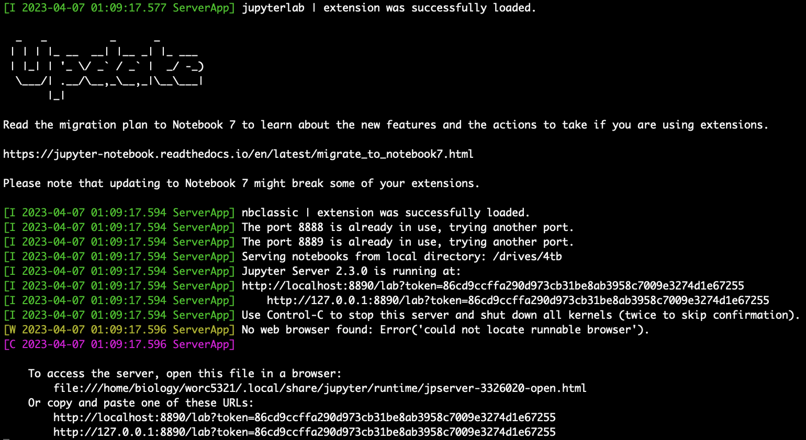
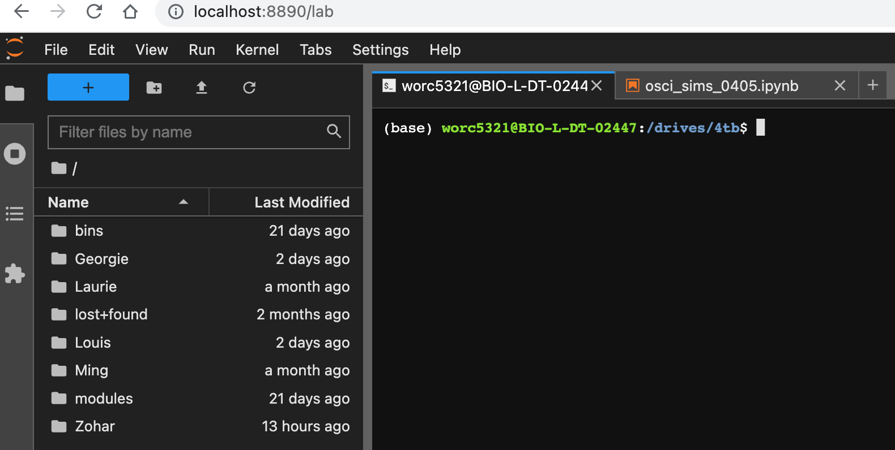
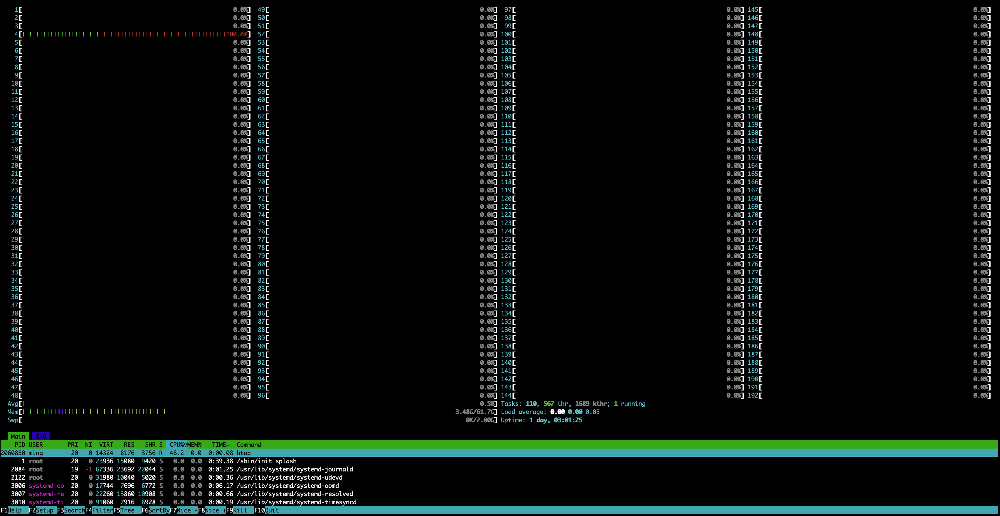
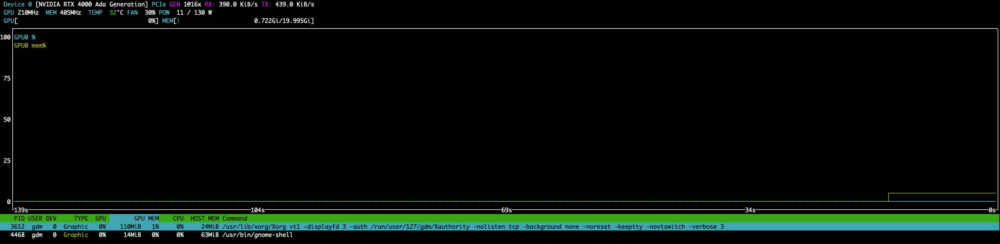
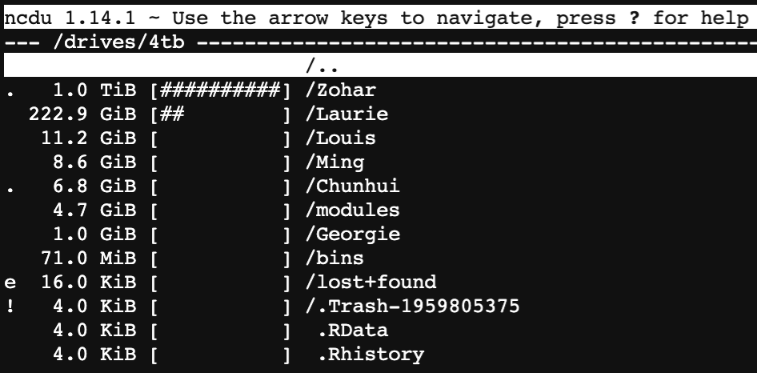
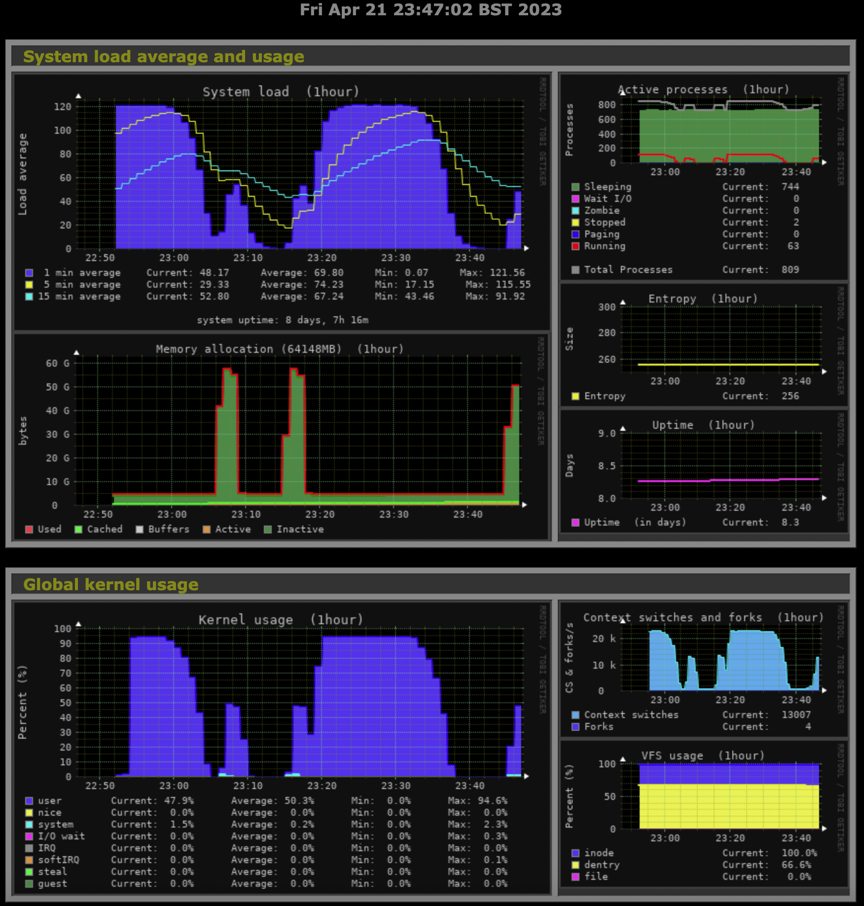
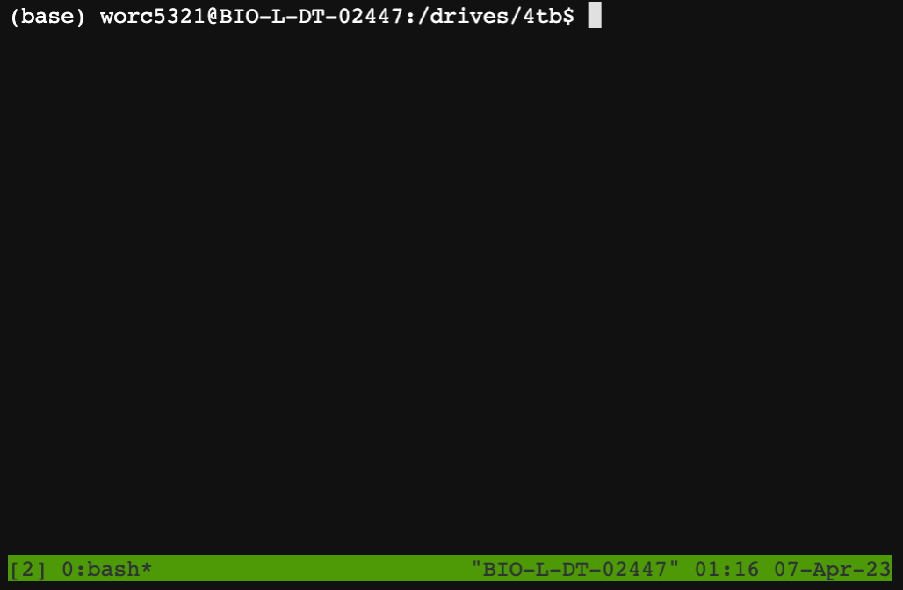
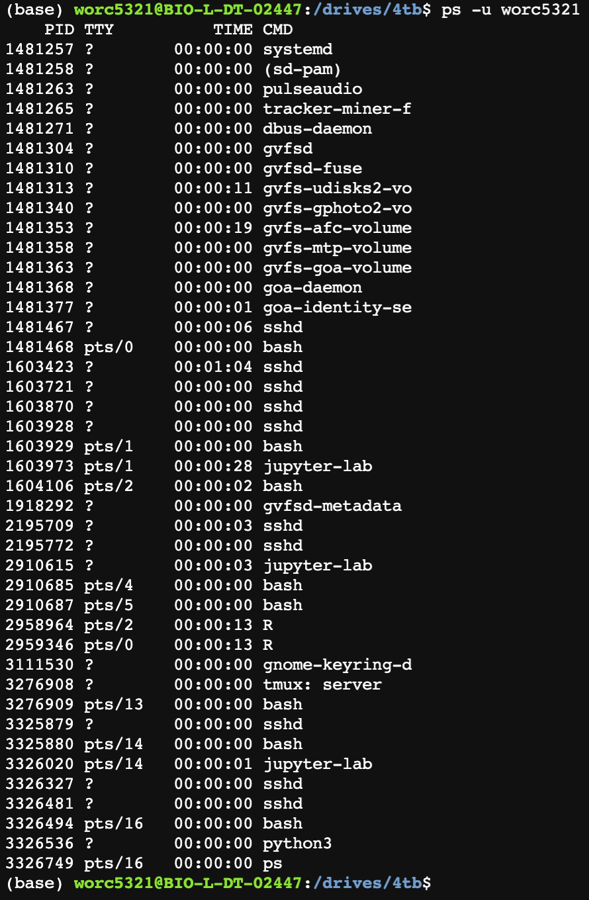
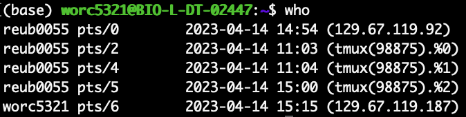

# StrasterTower User Manual

| Field | Details |
|---|---|
| Author | Ming Liu and Laura de Nies|
| Last updated | 14 May 2026 |
| Version | 2.1 |
| Scope | User guide for accessing and using StrasterTower |

---
<br><br>

## Table of contents

- [1. About the Straster Tower](#1-about-the-straster-tower)
  - [1.1 Drive structure and intended use](#11-drive-structure-and-intended-use)
  - [1.2 The relationships between machines](#12-the-relationships-between-machines)

- [2. Initialisation](#2-initialisation)
  - [2.1 Get started](#21-get-started)
    - [2.1.1 Configure your account](#211-configure-your-account)
    - [2.1.2 Connect to the server](#212-connect-to-the-server)
    - [2.1.3 Move to your personal folder](#213-move-to-your-personal-folder)

- [3. Install essential applications](#3-install-essential-applications)
  - [3.1 Install Miniconda/Miniforge](#31-install-minicondaminiforge)
  - [3.2 Install JupyterLab](#32-install-jupyterlab)

- [4. Useful commands and tools](#4-useful-commands-and-tools)
  - [4.1 Testing JupyterLab](#41-testing-jupyterlab)
  - [4.2 Basic linux commands](#42-basic-linux-commands)
  - [4.3 Monitoring the server](#43-monitoring-the-server)
    - [4.3.1 Monitoring computational load (htop and top)](#431-monitoring-computational-load-htop-and-top)
    - [4.3.2 Monitoring GPU](#432-monitoring-gpu)
    - [4.3.3 Monitoring disc space](#433-monitoring-disc-space)
    - [4.3.4 Check server activity history](#434-check-server-activity-history)
  - [4.4 Job management](#44-job-management)
    - [4.4.1 Submit jobs through tmux old section needs update](#441-submit-jobs-through-tmux-old-section-needs-update)
    - [4.4.2 Close inactive tmux sessions old section needs update](#442-close-inactive-tmux-sessions-old-section-needs-update)
    - [4.4.3 Check active jobs](#443-check-active-jobs)
    - [4.4.4 Check active connections](#444-check-active-connections)

- [5. Example code scripts old section needs update](#5-example-code-scripts-old-section-needs-update)
  - [5.1 The tab for jupyter connection](#51-the-tab-for-jupyter-connection)
  - [5.2 The tab for ssh connections](#52-the-tab-for-ssh-connections)
  - [Submitting parallel jobs from terminal with tmux](#submitting-parallel-jobs-from-terminal-with-tmux)

---
# 1. About the Straster Tower
Our server was purchased under the ERC and Wellcome Trust fungings. Many thanks to Kevin, Mathew, and Laura for providing such a great computational resource! This document is intended to be a walk-through tutorial and toolbox. 

Some housekeeping notes to mention first:

- Always use __htop__ or top to check current traffic before launching heavy tasks.
- __Read the welcome message__ to check disk storage and scheduled maintenance session.
- This machine is a __computation device__, not for long-term storage. Please always assume data is at risk and save important files to your local device or an appropriate backup location.
- Feel free to work in your personal Python environment, but __do not__ install R packages system-wide yourself.

## 1.1 Drive structure and intended use
The server contains four drives:

- Two solid state drives (SSD)
  - One system drive (500 GB)
  - One 4 TB drive located at `/drives/4tb`
- Two hard disk drives (HDD)
  - One 12 TB drive located at `/drives/12tb_foster`
  - One 12 TB drive located at `/drives/12tb_stracy`

In general:

- Use __`/drives/4tb`__ for simulations, numerical work, and statistical analysis.
- Use __`/drives/12tb_foster`__ and __`/drives/12tb_stracy`__ mainly for metagenomic work.
- Your user account will be assigned to either the Foster or Stracy group during setup.

The folder layout is organised as follows:

- Personal work folder on the 4 TB drive: `/drives/4tb/<your_username>`
- Shared folder on the 4 TB drive: `/drives/4tb/shared`
- Personal work folder on the relevant 12 TB drive:
  - `/drives/12tb_foster/<your_username>` or
  - `/drives/12tb_stracy/<your_username>`
- Shared group folder on the relevant 12 TB drive:
  - `/drives/12tb_foster/shared` or
  - `/drives/12tb_stracy/shared`

## 1.2 The relationships between machines

**Server structure.** StrasterTower acts as the main access and processing point. Users usually use **SSH** to log on to StrasterTower from their personal computers, manage or process data there, and use it to interact with the shared Foster & Stracy storage server. New images from the microscope computer are stored on the storage server, while raw and processed images can also be exchanged with the image analysis computer.

# 2. Initialisation
## 2.1 Get started
### 2.1.1 Configure your account
Please find Ming or Laura to set up an account.

During setup, we will:

- create your user account,
- assign you to the appropriate group (`foster` or `stracy`),
- create your personal folders on the relevant drives.

### 2.1.2 Connect to the server
Once you __activate the Oxford VPN__, you can access the server via:
```bash
ssh $USER@strastertower.path.ox.ac.uk
```
Replace `$USER` with your username. After typing the password, you should be in the server.

### 2.1.3 Move to your personal folder
After logging in, you should usually move to your personal folder on the 4 TB drive:
```bash
cd /drives/4tb/$USER
```
__PLEASE ALWAYS REMEMBER__ to move to your intended working directory whenever you log on to the server.

# 3. Install essential applications
## 3.1 Install Miniconda/Miniforge
We recommend installing Miniconda inside your personal folder on the 4 TB drive. You will manage your own environment so there will be

```bash
# Go to your personal folder on the 4 TB drive
cd /drives/4tb/$USER

# Download Miniconda installer
wget https://repo.anaconda.com/miniconda/Miniconda3-latest-Linux-x86_64.sh -O miniconda.sh

# Install Miniconda into your personal folder
bash miniconda.sh -b -p /drives/4tb/$USER/miniconda3

# Remove installer
rm miniconda.sh

# Activate Conda for this shell
source /drives/4tb/$USER/miniconda3/bin/activate

# Set up Conda for future bash sessions
conda init bash

# Reload shell configuration
source ~/.bashrc

# Check installation
conda --version
```

__Important__: do __not__ manually create the `miniconda3` folder before running the installer.

See [here](https://conda.io/projects/conda/en/latest/user-guide/tasks/manage-environments.html) for more information about managing conda environments.

## 3.2 Install JupyterLab
Assuming you are already inside the correct conda environment, you can install JupyterLab with:
```bash
conda install -c conda-forge jupyterlab -y
```

You can confirm that it was installed correctly with:
```bash
jupyter lab --version
```
# 4. Useful commands and tools

## 4.1 Testing JupyterLab
The following commands show how to activate JupyterLab, assuming you start from a fresh terminal tab.

```bash
# Connect to the server
ssh $USER@strastertower.path.ox.ac.uk

# Move to your intended working directory before launching JupyterLab
cd /drives/4tb/$USER

# Launch JupyterLab on your preferred port
# Please choose a favourite port between 8800 and 8900, and keep using it consistently
jupyter lab --port=8888
```

If activation is successful, you should see URLs printed in the terminal. We will use the generated token to connect through the browser.

<p align="center">
  
</p>

**Successful SSH login to StrasterTower.** After connecting with `ssh username@strastertower.path.ox.ac.uk`, users should see the Ubuntu login message, current disk-usage summary, and the StrasterTower welcome/reminder box. This confirms that the SSH connection has reached StrasterTower successfully.

<p align="center">
  
</p>

**Jupyter server startup message.** After starting Jupyter, the terminal should show that Jupyter Server is running and provide two browser URLs containing an access token. Both URLs shown near the bottom can be copied and pasted. To activate the link from your own computer, keep this Jupyter terminal session open and use another terminal tab to set up the connection; this will be explained in the next section.

__Open another terminal tab__ to create the connection to JupyterLab through the chosen port.

```bash
# Replace 8888 with your preferred port between 8800 and 8900
ssh -N -f -L 8888:localhost:8888 $USER@strastertower.path.ox.ac.uk
```

Now paste the URL shown by JupyterLab into your browser. It should look something like:

`http://localhost:8888/lab?token=...`

You can then:

1. run or edit files through the tabs inside JupyterLab,
2. drag files to the file browser on the left side to upload them,
3. download files by right-clicking them in the file browser.

`Folders` would need to be `zipped` before download.

<p align="center">
  
</p>

**JupyterLab opened successfully.** A successful connection opens JupyterLab in the local web browser at `localhost:8890/lab`. The file browser on the left shows the server directory, while the terminal or notebook panel on the right runs on StrasterTower, not on the user’s personal computer.

## 4.2 Basic linux commands
```bash
# Change directory
## Move to the upper-layer folder
cd ..
## Move to folder A in the current directory
cd A
# Check the content in the directory
ls
# Create a folder
mkdir foldername
# Move files or folders
mv source destination
# Copy files
cp source destination
# Remove files or folder
rm -r folder
# Zip files in terminal
zip -r newzipfile.zip folder
# Unzip to the current directory (where the zip file is in)
unzip zipfile.zip
```

## 4.3 Monitoring the server
### 4.3.1 Monitoring computational load (htop and top)

```bash
# Open htop, a server monitor
htop
# Quit htop
q
# Another tool that keeps the list in terminal after quitting
top
# Quit top
q
```
<p align="center">
  
</p>

**Checking server activity with `htop`.** The `htop` display shows current CPU, memory, swap, load average, uptime, and running processes on StrasterTower. It is useful for checking whether the server is busy before starting large jobs, and for identifying processes that are using substantial resources.

__Please Keep__ the CPU loading __BELOW 190__ to prevent the server from crashing (first number in *load average*). See [here](https://www.deonsworld.co.za/2012/12/20/understanding-and-using-htop-monitor-system-resources/) for some detailed explanation of htop.

### 4.3.2 Monitoring GPU

```bash
# Open nvtop, a server monitor
nvtop
# Quit nvtop
q
```

<p align="center">
  
</p>

**Checking GPU activity with `nvtop`.** The `nvtop` display shows live GPU utilisation, GPU memory use, temperature, fan speed, power use, and active GPU-related processes. In this example, the NVIDIA RTX 4000 Ada GPU is mostly idle, with only light memory use by the graphical desktop processes.

### 4.3.3 Monitoring disc space

```bash
# For general and simple overview
df -h
# For file management: activate ncdu
ncdu # It might take a while to scan all files
# Delete files+ yes
d
# Quit ncdu
q
```
<p align="center">
  
</p>

**Checking disk usage with `ncdu`.** The `ncdu` display shows how much storage each folder uses under `/drives/4tb`. Users can navigate with the arrow keys to identify large folders and manage their own files. This is useful for checking personal disk usage before adding large datasets or asking the server admin for help with storage cleanup.

### 4.3.4 Check server activity history

This one is a bit different, you need to open another local terminal tab and open the tool from browser.

```bash
# In your local terminal
ssh -N -f -L 8080:localhost:8080 $USER@strastertower.path.ox.ac.uk
# In your browser
localhost:8080/monitorix
```
<p align="center">
  
</p>

**Monitoring server activity with `Monitorix`.** `Monitorix` provides a browser-based summary of recent server activity, including system load, active processes, memory use, kernel usage, and other system-level metrics. It is useful for reviewing server behaviour over time, especially when diagnosing heavy workloads or checking whether a large job has caused sustained high load.

## 4.4 Job management
### 4.4.1 Submit jobs through tmux (old section, needs update)

```bash
# Starting a tmux session
tmux
# Run some task (the '&' symbol lets the system creates a task ID and allows you to run multiple things at the same time.)
python file.py &
R CMD BATCH file.R &
./a.out &
# Quit tmux
exit
```

<p align="center">
  
</p>


`TMUX` is useful when your program is terminated when SSH is disconnected from the server, TMUX make sure the session is free from the interference by SSH. Please see this [ask ububtu page](https://askubuntu.com/questions/8653/how-to-keep-processes-running-after-ending-ssh-session) for more information. __Please always check the current computation load before you submit jobs (with top or htop).__

### 4.4.2 Close inactive tmux sessions (old section, needs update)

```bash
# List current sessions
tmux list-sessions
# Kill session
tmux kill-session -t [session name]
# Kill all sessions
tmux kill-session -a
# You can also customise a session name
tmux new -s [session-name]
```

Please close the inactive tmux sessions to avoid lots of active connections to the server (each tmux session would be treated as a user).

### 4.4.3 Check active jobs

```bash
ps -u $USER
```

<p align="center">
  
</p>

### 4.4.4 Check active connections

```bash
who
```

<p align="center">
  
</p>

# 5. Example code scripts (old section, needs update)
## 5.1 The tab for jupyter connection

```bash
ssh $USER@strastertower.path.ox.ac.uk
cd /drives/4tb/$USER
jupyter lab --port=8888
# Ctrl + C to stop JupyterLab
# Ctrl + D to disconnect from ssh
```

## 5.2 The tab for ssh connections

```bash
# Activate connections
## For jupyter lab
ssh -N -f -L 8888:localhost:8888 $USER@strastertower.path.ox.ac.uk
## For monitorix (server activity monitor)
ssh -N -f -L 8080:localhost:8080 $USER@strastertower.path.ox.ac.uk

# In the browser
## For jupyter lab
http://localhost:8888/lab?token=........
## For monitorix
http://localhost:8080/monitorix

# Close the ports
lsof -ti:8888 | xargs kill -9
lsof -ti:8787 | xargs kill -9
lsof -ti:8080 | xargs kill -9
```

I would highly recommend you to copy the entire chunk of codes for daily uses, because closing port (i.e., lsof) can prevent causing problem on the local machine. Also, please properly turn off connections and terminate Jupyter to reduce server traffic and keep the dead connection as low as possible. In other words, __please do not close your laptop while still connected to the server!__

## Submitting parallel jobs from terminal with tmux

```bash
# Wait until tmux has been activated
tmux

# An example of C
## Compile the script
gcc code.c -lm -O2
## Copy complied file (a.out) to all sub-folders
for d in */; do cp a.out "$d"; done
## Submit the jobs
cd folder_1
## Put '&' to return to terminal command line, the system will generate a job id for the submitted task
./a.out x=0 &
cd ../folder_2
./a.out x=1 &

# An example of Python
## Copy python script to all sub-folders
for d in */; do cp code.py "$d"; done
## Suubmit the jobs
cd folder_1
python code.py a=0 b=0 &
cd ../folder_2
python code.py a=0 b=1 &

# An example of R
## Go to the folder containing the files you want to do some analysis
cd folder_with_data
## Launch the analysis in parallel
R CMD BATCH ../AnalysisCodes/Analysis1.R &
R CMD BATCH ../AnalysisCodes/Analysis2.R &
R CMD BATCH ../AnalysisCodes/Analysis3.R &
## Remember to add '.libPaths(c(.libPaths(), "/drives/4tb/modules/R"))' to your analysis code files

# An example of Matlab
## Go to the folder that contain your script
cd folder_with_codes
## Launch the script named script.m
matlab -batch "script" > script.log 2>&1 & 

# close tmux
exit
```

__Remember__ to close the inactive tmux sessions after jobs are completed:

```bash
tmux kill-session -a
```
